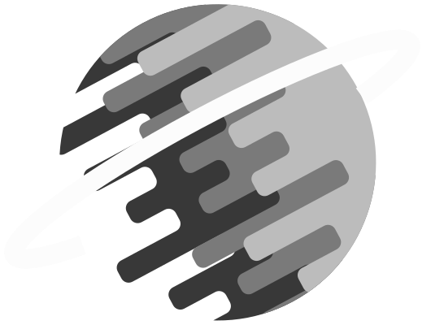

# Solar System

This project was done by Timo Tamminiemi and Eric Keränen as the final project of a 3D-modeling and mixed reality
course for Metropolia UAS. The goal of the project was to make an application that somehow utilized 3D objects, panorama
images, 360 images, XR (extended reality) elements or photogrammetry. We decided to go with a web application where the
user can explore a 3D Solar System. The project was designed to be more educational in nature so we decided to add
interesting facts and information about the objects in our Solar System.

## Features

- Explore the Solar System in a 3D environment

- Read interesting facts about our Solar System

- Follow the orbit of any body in our Solar System

- Stop the orbiting to read facts of the smaller bodies

- Have fun in our experimental sandbox VR mode!
- Grab planets and move them around

- Speed up and/or invert orbiting direction

- You can also grab any object, even the ring!

## Project Goals

The goal was to make a working web application that utilized Three.js. In this we achieved our goal.

### Framework

As the framework to speed up web development we used [Next.js](https://nextjs.org/). Next.js sped up the development a
lot, but also brought a lot of headaches with Three.js and VR. We realized too late that it would've made more sense to
use [react-three-fiber](https://github.com/pmndrs/react-three-fiber) to develop our app. Time restraints meant that we
couldn't make the change and complete the project on time. At the end we were happy to choose Next.js over vanilla even
after all the problems, since Next.js had a lot of helpful features like making the Panorama background of our pages a
component.

Using Next.js also provided us an extremely easy way to deploy our project to production. For this we used Next.js' own
deployment platform called Vercel.

[https://space-project-gamma.vercel.app/](https://space-project-gamma.vercel.app/)

### 3D Graphic library

As our 3D graphic library, which was the most important choice, we chose [Three.js](https://threejs.org/). Other options
would've included [A-Frame](https://aframe.io/) or [BabylonJS](https://www.babylonjs.com/) which we checked out.
Three.js had the most comprehensive examples and included clear code and explanations. We followed a 
[Youtube video](https://www.youtube.com/watch?v=XXzqSAt3UIw) by Wael Yasmina to get the project started. After getting
the basic scene done, we added our own elements and animations.

### Animations

Animations were done by using [Tween.js](https://github.com/tweenjs/tween.js/). Another option would've been 
[GSAP](https://greensock.com/gsap/). Transitions between planets and description fading were done by Tween.js. We were
really surprised and happy about the result Tween.js brought to the table.

### Textures

Textures we downloaded from websites that had high resolutions versions of them. Textures were from three different 
sources, which are:

1. [Tyro 3D SPace panoramas (cubemaps)](https://tools.wwwtyro.net/space-3d/index.html)
2. [Solar System textures](https://www.solarsystemscope.com/textures/)
3. [Most moon textures](https://www.celestiamotherlode.net/)

## Technology stack

- [Next.js](https://nextjs.org/) - React framework
- [Three.js](https://threejs.org/) - 3D computer graphic library
- [Tween.js](https://github.com/tweenjs/tween.js/) - animation engine 
- [Sass](https://sass-lang.com/) - CSS preprocessor
- [Git](https://git-scm.com/) - version control

## Improvements

There is a lot of room for improvements in our project. First off, the performance on lower end system is quite bad and
thus makes the experience of exploring the Solar System quite horrendous. The web application is not supported on mobile
phones. VR mode of quite experimental because of time restraints and thus has quite little functionality and a lot of
bugs. Many performance issues also arise since we are using useEffect from React to render all the 3D stuff from Three.js
so changing pages and going back in history causes a forced context loss which reloads everything. This is really bad
practice, but we didn't find any other solution. 

Aside from performance issues, more moons could be added. We only added moons we found textures for and because of that
reason there aren't that many moons, even though in reality there are hundreds of moons. Asteroid belts could also be
added.

VR mode is quite barren in terms of things to do. This means that adding some kind of fun functionality is needed. This
would also increase the amount of content and things to do which is always welcome especially In this kind of application
which is more educational in nature. Also since we aimed for a more "educational" nature application where the main
point is exploring the Solar System and learning a fact or two on the way.

## Contributors

- Eric Keränen
- Timo Tamminiemi